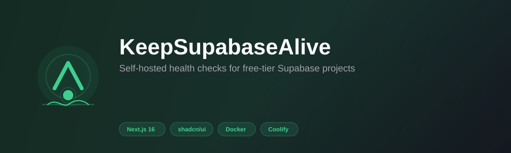
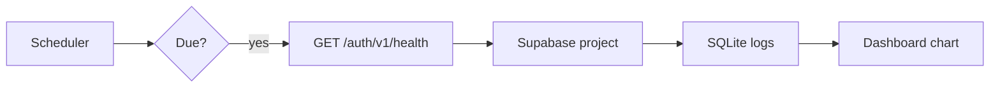

<p align="center">
  <a href="https://github.com/flogesell/keepsupabasealive">
    
  </a>
</p>

<h1 align="center">KeepSupabaseAlive</h1>

<p align="center">
  <strong>Self-hosted dashboard & scheduler to keep free-tier Supabase projects from pausing.</strong>
</p>

<p align="center">
  <a href="LICENSE"></a>
  <a href="https://bun.sh"></a>
  <a href="https://nextjs.org"></a>
  <a href="https://www.typescriptlang.org"></a>
  <a href="https://ui.shadcn.com"></a>
  <a href="https://www.docker.com"></a>
  <a href="https://coolify.io"></a>
</p>

<p align="center">
  
</p>

<p align="center">
  <a href="#quick-start">Quick start</a> ·
  <a href="#features">Features</a> ·
  <a href="#deploy-with-coolify">Coolify</a> ·
  <a href="#how-it-works">How it works</a> ·
  <a href="#api">API</a> ·
  <a href="#contributing">Contributing</a>
</p>

---

> **Note:** This project is **not affiliated with, endorsed by, or sponsored by** [Supabase](https://supabase.com). It is an independent open-source tool built by the community for developers who self-host their infrastructure.

## The problem

Supabase **pauses free-tier projects** after about **7 days** without API activity. If a project stays paused for **90 days**, it can be **permanently deleted**.

Many developers run side projects on the free tier and forget to touch them — this app automates lightweight **Auth health checks** so your projects stay awake.

## Features

| | |
|---|---|
| 📊 **Dashboard** | All projects, live status, 24h success rate |
| ➕ **Project management** | Add, pause, resume, delete from the UI |
| 📈 **Activity chart** | shadcn/ui stacked area chart (24h / 3d / 7d) |
| ⏱️ **Built-in scheduler** | Cron-style checks every minute; pings when due |
| ⚡ **Manual ping** | Trigger an immediate health check |
| 🐳 **Self-hosted** | SQLite, Docker, [Coolify](https://coolify.io) — your data stays on your server |
| 🔐 **Dashboard auth** | Optional HTTP Basic Auth via `DASHBOARD_PASSWORD` (recommended in production) |
| 🛡️ **Safe by design** | Auth health endpoint only — no database queries, no `service_role` |

## How it works



Every minute, the built-in scheduler checks which projects are due. For each project it sends:

```http
GET https://<project-ref>.supabase.co/auth/v1/health
apikey: <your-anon-public-key>
Authorization: Bearer <your-anon-public-key>
```

This matches the approach used by community tools such as [wake-up-supabase](https://github.com/wilhelmsendk/wake-up-supabase). **Without the `apikey` header**, hosted Supabase responds with:

```json
{ "error": "requested path is invalid" }
```

### What this app does **not** do

- Query PostgREST (`/rest/v1/`) or your database tables  
- Use the **service_role** key  
- Read or write application data  

Only the public **anon** key is stored (required by Supabase’s gateway), and only on your self-hosted instance.

## Quick start

### Prerequisites

- [Bun](https://bun.sh) 1.2+ (recommended) or Node.js 20+

### Local development

```bash
git clone https://github.com/flogesell/keepsupabasealive.git
cd keepsupabasealive
cp .env.example .env
bun install
bun run dev
```

Open **http://localhost:3000** → **Add project** and fill in:

| Field | Where to find it | Example |
|-------|------------------|---------|
| **Name** | Any label | `My side project` |
| **URL or ref** | Project Settings → API → Project URL | `https://abcdefgh.supabase.co` or `abcdefgh` |
| **Anon key** | Project Settings → API → `anon` `public` | `eyJhbGciOiJIUzI1NiIsInR5cCI6IkpXVCJ9...` |
| **Interval** | How often to ping | Every 6 hours (recommended) |

> Use the **anon public** key only. Never use `service_role`.

Dashboard URLs like `https://supabase.com/dashboard/project/<ref>` are also accepted — the project ref is extracted automatically.

## Deploy with Coolify

<p align="left">
  
  &nbsp; Add this GitHub repository as your Coolify application source.
</p>

1. In **Coolify** → **+ New** → **Application**.
2. Under **Source**, choose **GitHub** (or GitLab / Gitea) and select **this repository** — public or private after authorizing Coolify once.
3. Pick your branch (e.g. `main`) and set the build pack to **Dockerfile**.
4. Add **Persistent Storage** (application → **Storages** → **+ Add**).

   **Volume mount (recommended)**

   | Field | Value |
   |-------|-------|
   | **Name** | `data` (Coolify may append your app UUID to avoid clashes) |
   | **Source Path** | *(leave empty — Docker creates the volume)* |
   | **Destination Path** | `/data` |

   
5. Add these environment variables:

| Variable | Value | Required |
|----------|-------|----------|
| `DATABASE_PATH` | `/data/keepsupabasealive.db` | Yes |
| `DASHBOARD_PASSWORD` | Long random password | **Yes (production)** |
| `ENCRYPTION_KEY` | `openssl rand -hex 32` | **Yes (production)** |
| `CRON_SECRET` | `openssl rand -hex 32` | **Yes (production)** |
| `DASHBOARD_USER` | `admin` (default) | No |
| `PORT` | `3000` | Usually set by Coolify |

6. Set health check path to **`/api/health`** → **Deploy**.

Coolify builds from the repo on every push — nothing else to publish.

### Docker Compose

```bash
docker compose up -d --build
```

Data persists in the `keepsupabasealive-data` volume.

## Environment variables

| Variable | Default | Description |
|----------|---------|-------------|
| `DATABASE_PATH` | `./data/keepsupabasealive.db` | SQLite database file |
| `DASHBOARD_PASSWORD` | — | HTTP Basic Auth (required in production) |
| `DASHBOARD_USER` | `admin` | Username for Basic Auth |
| `ENCRYPTION_KEY` | — | AES-256-GCM encryption for anon keys at rest (required in production) |
| `CRON_SECRET` | — | Bearer token for `POST /api/cron` (required in production) |
| `DISABLE_SCHEDULER` | `false` | Set `true` to disable built-in pings |
| `PORT` | `3000` | HTTP port |

Generate secrets:

```bash
openssl rand -hex 32   # ENCRYPTION_KEY and/or CRON_SECRET
```

## API

| Method | Path | Description |
|--------|------|-------------|
| `GET` | `/api/projects` | List projects with stats (anon keys omitted) |
| `POST` | `/api/projects` | Create a project |
| `PATCH` | `/api/projects/:id` | Update a project |
| `DELETE` | `/api/projects/:id` | Delete a project |
| `POST` | `/api/projects/:id/ping` | Run a health check now |
| `GET` | `/api/stats?hours=24` | Chart data (`hours`: 1–168) |
| `POST` | `/api/cron` | Run all due pings (`Authorization: Bearer <CRON_SECRET>`, required in production) |
| `GET` | `/api/health` | App health check |

## Security

### Production checklist

When `NODE_ENV=production`, the app **refuses to start** without:

| Variable | Purpose |
|----------|---------|
| `DASHBOARD_PASSWORD` | HTTP Basic Auth on dashboard + API |
| `ENCRYPTION_KEY` | Encrypts Supabase anon keys in SQLite |
| `CRON_SECRET` | Bearer token for `POST /api/cron` |

**Deployment checklist:**

- [ ] Set all three variables above (use `openssl rand -hex 32`)
- [ ] Serve the app over **HTTPS** (Coolify / reverse proxy)
- [ ] Mount `/data` on a **persistent volume** with restricted host access
- [ ] Never store **service_role** keys — anon public keys only
- [ ] Restrict who can reach the URL (VPN / IP allowlist optional extra layer)
- [ ] Back up `/data` securely — backups contain encrypted keys
- [ ] After enabling `ENCRYPTION_KEY`, restart once — existing plaintext keys are auto-migrated

### What is protected

| Layer | Behavior |
|-------|----------|
| **Dashboard & API** | HTTP Basic Auth when `DASHBOARD_PASSWORD` is set |
| **Failed logins** | Rate limited (5 failures / 15 min per IP) |
| **Anon keys in DB** | Encrypted at rest with `ENCRYPTION_KEY` (AES-256-GCM) |
| **API responses** | Anon keys never returned from `GET /api/projects` |
| **SQL injection** | Drizzle ORM + Zod validation — no raw user SQL |
| **Remote DB access** | SQLite file only — no open database port |

### Public endpoints (by design)

| Path | Why |
|------|-----|
| `/api/health` | Coolify / Docker health checks |
| `/api/cron` | Requires `Authorization: Bearer <CRON_SECRET>` in production |

### Local development

With `NODE_ENV` unset or `development`, auth and encryption env vars are **optional**:

- No `DASHBOARD_PASSWORD` → dashboard open
- No `ENCRYPTION_KEY` → anon keys stored as plaintext in SQLite
- No `CRON_SECRET` → `/api/cron` accepts unauthenticated requests

### Limitations

- HTTP Basic Auth sends credentials per request (use HTTPS).
- Encryption protects the DB file, not a compromised running container.
- Single shared dashboard password — no per-user accounts yet.
- Comply with [Supabase Terms of Service](https://supabase.com/terms).

## Development

```bash
bun run dev          # Development server
bun run build        # Production build
bun run start        # Production server
bun run lint         # ESLint
bun run db:generate  # Generate Drizzle migrations
```

Migrations run automatically on startup.

### Tech stack

<p>
  
  
  
  
  
</p>

- [Next.js 16](https://nextjs.org) — App Router, standalone output  
- [shadcn/ui](https://ui.shadcn.com) + [Tailwind CSS 4](https://tailwindcss.com)  
- [SQLite](https://www.sqlite.org) + [Drizzle ORM](https://orm.drizzle.team)  
- [Recharts](https://recharts.org) via shadcn Charts  

## Contributing

Contributions are welcome! Please open an [issue](https://github.com/flogesell/keepsupabasealive/issues) or [pull request](https://github.com/flogesell/keepsupabasealive/pulls).

## License

[MIT](LICENSE) — free to use, modify, and distribute.

---

<p align="center">
  
  <br />
  <sub>Built with ☕ for developers who forget to ping their side projects.</sub>
  <br /><br />
  <a href="https://supabase.com">
    
  </a>
  <br />
  <sub>Supabase® is a trademark of Supabase, Inc. This project is independent.</sub>
</p>
